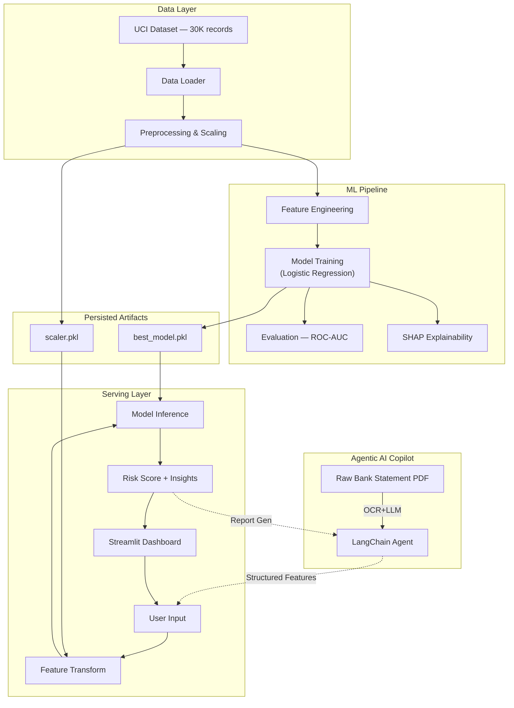

# Credit Risk Analyzer & Agentic Underwriting Copilot

**Explainable AI Lending System with Automated OCR Agent**

An end-to-end machine learning system that predicts credit card default risk, provides explainable AI insights via SHAP, and features a built-in LangChain Agentic Copilot to automate document parsing via OCR.
---
## Problem Statement

Consumer credit default costs financial institutions billions annually. Traditional manual underwriting misses complex patterns, and loan officers spend countless hours manually extracting data from messy bank statements.

This project solves both problems by building a **complete credit risk pipeline**. It includes an **Automated Underwriting Copilot** that uses an LLM to extract data from raw PDFs, runs it through the machine learning model, relies on SHAP explainability, and enforces a "Human-in-the-Loop" workflow for grey-zone risk predictions.

---

## Demo

<p align="center">
  
</p>

---

## Features

- **Agentic AI Copilot** — LangChain-powered ReAct agent that automates document data extraction and context-aware financial Q&A (Powered by Groq Llama 3.3).
- **Automated Underwriting OCR** — Intelligent PDF text parsing connected directly to the structured feature pipeline models.
- **Human-in-the-Loop Risk Profiling** — Grey-zone escalation flow requiring manual review when AI confidence dips below safe thresholds.
- **Full ML Pipeline** — data ingestion, feature engineering, preprocessing, model training, evaluation, and serving
- **Explainability** — SHAP-based feature importance analysis for every prediction (why did the model decide this?)
- **Production UI** — dark-themed fintech dashboard built with Streamlit, responsive and deployment-ready
- **Engineered Features** — 8 derived financial indicators (credit utilization, payment ratio, delay severity, bill trends)
- **Data-Driven Insights** — automated risk factor analysis explaining each prediction with color-coded reasoning
- **Deployment-Ready** — environment variable configuration, absolute path resolution, single-command launch

---

## Tech Stack

| Layer | Technology |
|---|---|
| Language | Python 3.12 |
| ML Framework | scikit-learn |
| Explainability | SHAP |
| Web UI | Streamlit |
| Data | Pandas, NumPy |
| Serialization | Joblib |
| Dataset | UCI Taiwan Credit Card Default (30,000 records) |

---

## System Design



---

## Project Structure

```
credit-risk-analyzer/
├── notebooks/
│   ├── 01_eda.ipynb                          # Exploratory data analysis
│   ├── 02_preprocession_feature_scaling.ipynb # Preprocessing & scaling
│   ├── 03_model_training.ipynb               # Model training & evaluation
│   └── 04_shap_explainability.ipynb          # SHAP feature importance
├── src/
│   ├── data.py                               # Data loading utilities
│   ├── features.py                           # Feature engineering (8 derived features)
│   ├── preprocess.py                         # Preprocessing & scaling pipeline
│   ├── train.py                              # Model training script
│   └── predict.py                            # Inference utilities
├── models/
│   ├── best_model.pkl                        # Trained Logistic Regression model
│   └── scaler.pkl                            # Fitted StandardScaler
├── app.py                                    # Streamlit dashboard (single-file, self-contained)
├── data/
│   ├── credit_card_default_dataset.csv       # Raw UCI dataset
│   └── processed_data.pkl                    # Preprocessed feature matrix
├── screenshots/
│   └── ui.png                                # Dashboard screenshot
├── requirements.txt
└── README.md
```

---

## Machine Learning Pipeline

```
Raw Data (30K records, 24 features)
    │
    ▼
┌─────────────────────────────┐
│  Feature Engineering        │
│  + AVG_BILL_AMT             │
│  + CREDIT_UTILITY           │
│  + AVG_PAY_DELAY            │
│  + PAYMENT_TO_BILL          │
│  + MAX_PAY_DELAY            │
│  + NUM_LATE_MONTHS          │
│  + PAYMENT_STD              │
│  + SEVERE_DELAY_FLAG        │
└─────────────────────────────┘
    │
    ▼
Preprocessing (One-Hot Encoding + Standard Scaling)
    │
    ▼
Model Training (Logistic Regression — selected via cross-validation)
    │
    ▼
Evaluation (ROC-AUC, Confusion Matrix, Classification Report)
    │
    ▼
SHAP Explainability (Global + Local Feature Importance)
    │
    ▼
Streamlit Dashboard (Real-Time Prediction + Data-Driven Insights)
```

---

## Model Performance

| Metric | Score |
|---|---|
| **ROC-AUC** | ~0.75 |
| **Algorithm** | Logistic Regression |
| **Training Set** | 30,000 records (UCI Taiwan Credit) |

**Interpretation:** A ROC-AUC of 0.75 indicates the model correctly ranks a random defaulter above a random non-defaulter 75% of the time. While not production-threshold for autonomous decisions, it provides strong directional guidance for human-in-the-loop lending workflows.

---

## Installation & Setup

**Prerequisites:** Python 3.10+

```bash
# 1. Clone the repository
git clone https://github.com/SatyamKumarCS/credit-risk-analyzer.git
cd credit-risk-analyzer

# 2. Create virtual environment
python -m venv venv
source venv/bin/activate        # macOS/Linux
# venv\Scripts\activate         # Windows

# 3. Install dependencies
pip install -r requirements.txt

# 4. Environment Variables
cp .env.example .env
# Open .env and add your GROQ_API_KEY for the AI Copilot to work
```

---

## Usage

### Run the Dashboard & AI Copilot

The dashboard is now a multi-page app. The home page is the manual risk analyzer, and the sidebar contains the AI Underwriting Copilot.

```bash
streamlit run app.py
```

Opens at **http://localhost:8501**

### Generate Sample Statement
If you want to test the AI Copilot without using a real bank statement, generate the dummy PDF by running:

```bash
python scripts/generate_sample_pdf.py
```
This will create a `samples/sample_statement.pdf` file you can upload to the Copilot.

### Run the Notebooks

Execute in order for full pipeline reproduction:

```bash
jupyter notebook notebooks/
```

1. `01_eda.ipynb` — data exploration and visualization
2. `02_preprocession_feature_scaling.ipynb` — preprocessing pipeline
3. `03_model_training.ipynb` — model training and evaluation
4. `04_shap_explainability.ipynb` — SHAP analysis

### Retrain the Model

```bash
python src/train.py
```

---

## Future Improvements

- **Threshold Optimization** — tune decision threshold using precision-recall tradeoff for business-specific cost matrices
- **Model Upgrades** — experiment with XGBoost, LightGBM, and neural networks for improved AUC
- **Cloud Deployment** — containerize with Docker, deploy to Streamlit Community Cloud / Render
- **Monitoring** — add prediction drift detection and model performance tracking
- **Batch Processing** — CSV upload for bulk risk assessment
- **API Layer** — FastAPI endpoint for programmatic integration

---

## Key Highlights

> Designed for recruiters and reviewers scanning in 30 seconds.

- **Agentic Underwriting Copilot**: Automates PDF extraction and decision orchestration via LangChain & Groq Llama 3.3.
- **Human-in-the-Loop**: Safely flags "Grey Zone" applicants for mandatory manual overriding.
- **End-to-End ML System**: Data ingestion → Features → Model → Explainability → UI.
- **SHAP-powered explainability**: Not just raw predictions, but *why* they happened.
- **Production-grade**: Streamlit dashboard with dark fintech aesthetics and environment management.

---

## License

This project is open-source under the [MIT License](LICENSE).

---

## Author

**Satyam Kumar**

- GitHub: [@SatyamKumarCS](https://github.com/SatyamKumarCS)
- Project: [Credit Risk Analyzer](https://github.com/SatyamKumarCS/Default-Credit-Card-Prediction)
